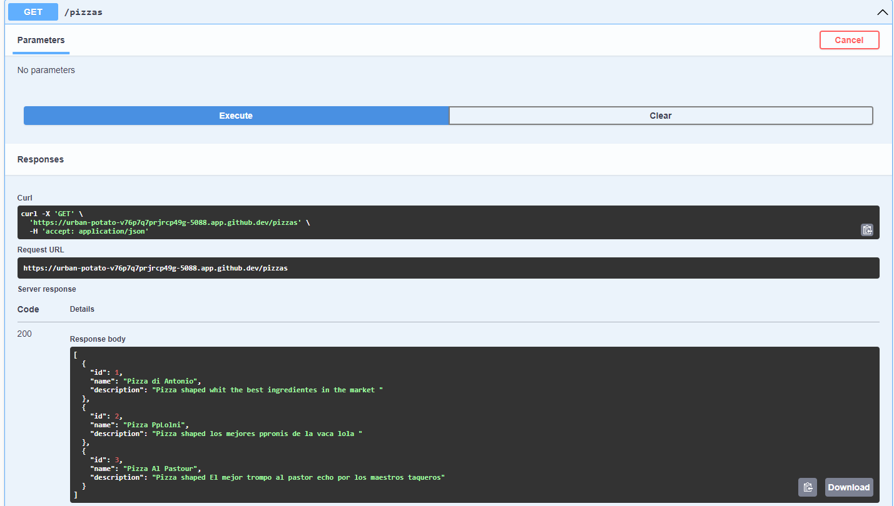

# API-Minima.cs

Practica de mi primera API mínima con .NET

## Informacion General

La creacion de esta practica esta basanda en un recurso de Microsoft learn:

**Creación de aplicaciones web y servicios con ASP.NET Core, API mínima y .NET**.  

Link: <https://learn.microsoft.com/es-es/training/paths/aspnet-core-minimal-api/>

## Introduccion

La creación de una API web es una tarea común. Es recomendable poder ofrecer algunos datos y saber cómo los consume una aplicación o servicio. La forma de compilar la API puede diferir enormemente entre las pilas tecnológicas. A la hora de compilar una API, sabe que son muchas las partes que hay que tener en cuenta, como el almacenamiento de datos, la seguridad, el control de versiones y la documentación. Conseguir que todas estas partes funcionen puede ser una tarea compleja.

### Escenario: Creación de un prototipo

Usted es desarrollador en un equipo. Como parte de su trabajo, compila y mantiene muchas API. También experimenta un poco con nuevas tecnologías para determinar si son una buena opción para las necesidades de la empresa. Le gustan los marcos que le permiten crear una API con solo unas pocas líneas de código, ya que un resultado rápido facilita una buena conversación con compañeros y otras partes interesadas. Se supone que puede agregar más características más adelante a medida que la API crece en complejidad.

### ¿Qué aprenderá?

Aprenderá a compilar lo que se conoce como una API mínima mediante ASP.NET Core y .NET 8. Como parte de la creación de la API, agregará varias construcciones de ruta para controlar la lectura y escritura de datos. También agregará Swagger para asegurarse de que tiene una manera de documentar la API.

#### ¿Cuál es el objetivo principal?

Cree una API eficaz que admita la lectura y la escritura con solo unas pocas líneas de código.

## ¿Qué es una API mínima?

La creación de una API puede ser compleja, ya que debe admitir muchas características, como el enrutamiento, la lectura y la escritura en un almacenamiento de datos y la autenticación. Para ahorrar tiempo, comience con los marcos y las plantillas integrados en .NET, que ofrece muchas de las características que necesita. Sin embargo, esos marcos pueden requerir una configuración considerable hasta llegar a una API básica en funcionamiento. Con una API mínima para .NET 6, no es el caso. Puede empezar a trabajar con unas pocas líneas de código.

Para empezar a trabajar con la API mínima, el requisito principal es usar al menos .NET 6. A continuación, necesita un editor de texto, como Visual Studio o Visual Studio Code, o cualquier otro editor de texto de su elección. Por último, puede usar un sistema operativo Windows, macOS o Linux.

## ¿Qué es una API mínima? (continuación)

Si ha desarrollado una API web de .NET, ha estado usando un enfoque con controladores. La idea es tener un método de clase de controlador, que representa varios verbos HTTP, y realizar una operación para completar una tarea específica. Por ejemplo, GetProducts() devolvería productos mediante GET como verbo HTTP.

¿Cuál es la diferencia entre este enfoque basado en controlador y la API mínima?

Program.cs simplificado: la plantilla de la API web basada en controlador conecta los controladores mediante el método AddControllers. Además, conecta Swagger para proporcionar compatibilidad con OpenAPI. Las API mínimas no tienen esta conexión de forma predeterminada, aunque puede agregar Swagger si lo desea.

El enrutamiento tiene un aspecto algo diferente: el enrutamiento tiene un aspecto ligeramente diferente en comparación con una API web basada en controlador. En una API web, para el enrutamiento, se debe escribir el código como se muestra a continuación:

```csharp
app.UseRouting();
app.UseEndpoints(endpoints =>
{
    endpoints.MapControllers();
    // add my own routes
});
```

```csharp
app.MapGet("/todos", await (TodoDb db) => db.Todos.ToListAsync());
app.MapPost("/todos", await (Todo todo) => {});
app.MapPut("/todos", (Todo todo) => {});
app.MapDelete("/todos/{id}", (int id) => {});
```

La misma funcionalidad sigue estando ahí. Configurará igualmente una base de datos y CORS y agregará la autenticación de la forma habitual.

## Capturas de pantalla


